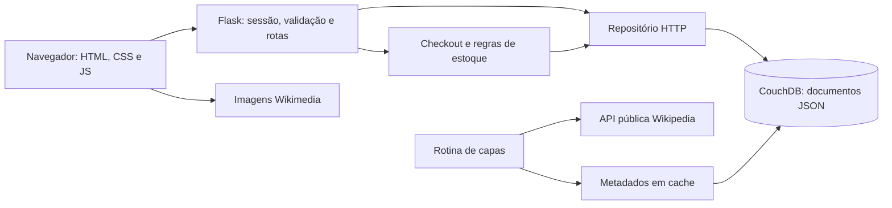
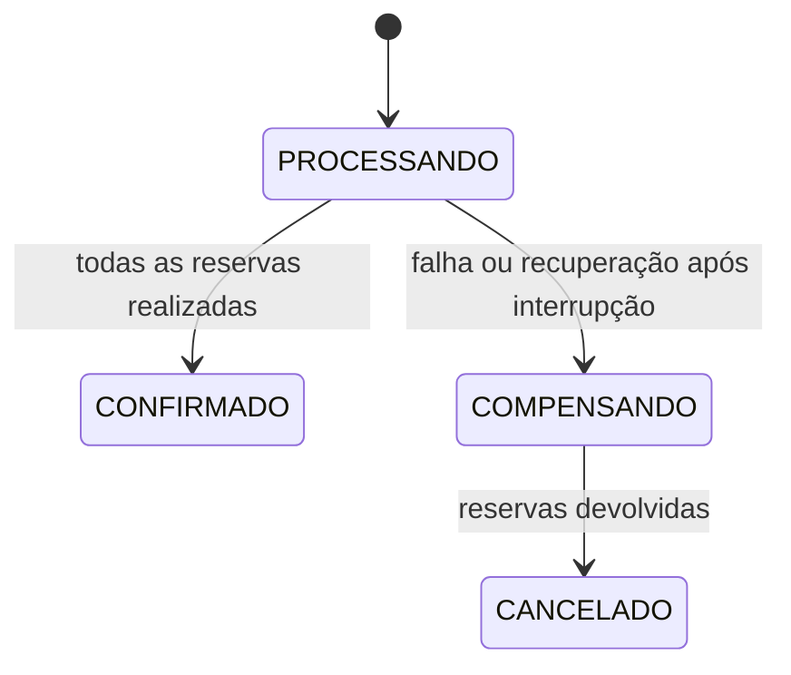

# PlayShelf — projeto e modelagem

## 1. Problema e solução

Uma loja de jogos físicos precisa apresentar seu catálogo, identificar clientes, controlar estoque e registrar pedidos. A PlayShelf atende colecionadores com uma interface simples, capas em destaque e identificação explícita do console. Os dados comerciais são fictícios.

O CouchDB foi escolhido conforme o enunciado e o padrão de acesso: cada pedido é normalmente lido inteiro, incluindo seus itens. JSON representa bem esse agregado, o protocolo HTTP simplifica a integração com Flask e as revisões permitem demonstrar concorrência. Uma solução relacional também seria válida; a escolha documental exige tratar relações e operações entre documentos na aplicação.

## 2. Requisitos e critérios de aceitação

| ID | Requisito | Critério verificável |
|---|---|---|
| RF01 | Explorar catálogo | Exibir apenas produtos ativos; filtrar console/gênero e buscar nome |
| RF02 | Consultar jogo | Mostrar edição/plataforma, preço, estoque, mídia e fonte da capa |
| RF03 | Gerenciar sacola | Adicionar, alterar entre 1 e 20 unidades ou remover; respeitar estoque |
| RF04 | Identificar cliente | Registrar e-mail único, autenticar e encerrar sessão |
| RF05 | Comprar | Autenticar, recalcular valores no servidor e registrar pedido simulado |
| RF06 | Consultar pedidos | Cada cliente acessa somente seus próprios pedidos |
| RF07 | Concorrência | Última unidade não pode ser confirmada em duas compras |
| RF08 | Repetição | Reenvio do mesmo checkout retorna o mesmo pedido |
| RF09 | Falha parcial | Devolver reservas realizadas quando um checkout falha |
| RF10 | Capas | API fornece URL e procedência; falha de imagem mostra alternativa |
| RNF01 | Persistência | Clientes, produtos e pedidos ficam no CouchDB real |
| RNF02 | Usabilidade | Layout adaptável, teclado, rótulos, foco e redução de movimento |
| RNF03 | Segurança | Hash de senha, CSRF, validação, cookies e segredos externos |
| RNF04 | Operação | Health check, testes, configuração reproduzível e documentação |

## 3. Arquitetura



JavaScript abre a busca, altera campos de quantidade e atualiza a prévia do frete. O servidor sempre valida e recalcula a operação. Nenhuma credencial do CouchDB é enviada ao navegador. O repositório em memória existe exclusivamente nos testes unitários.

## 4. Modelo documental

Um banco `playshelf`, três tipos de documento e cinco índices JSON. Os exemplos abaixo são reduzidos e ilustrativos; `_rev` é gerado pelo CouchDB.

### Produto

```json
{
  "_id": "produto:zelda-tears-switch",
  "_rev": "2-exemplo",
  "tipo": "produto",
  "schema_version": 1,
  "slug": "zelda-tears-switch",
  "nome": "The Legend of Zelda: Tears of the Kingdom",
  "plataforma": "Nintendo Switch",
  "console": "switch",
  "genero": "Aventura",
  "midia": "Física",
  "condicao": "Novo e lacrado",
  "preco_centavos": 29990,
  "estoque": 11,
  "ativo": true,
  "capa_url": "https://upload.wikimedia.org/...",
  "movimentos": {
    "pedido:exemplo": {"quantidade": 1, "status": "reservado"}
  }
}
```

### Cliente

```json
{
  "_id": "cliente:sha256-do-email-normalizado",
  "tipo": "cliente",
  "schema_version": 1,
  "nome": "Pessoa de demonstração",
  "email": "demo@example.test",
  "senha_hash": "scrypt:...",
  "criado_em": "2026-09-14T23:00:00+00:00"
}
```

O ID determinístico torna o e-mail único mesmo com dois cadastros simultâneos: o segundo PUT recebe 409. O hash do e-mail é identificador, **não anonimização**. O hash scrypt da senha é outra coisa: armazena uma verificação derivada, com salt, em vez da senha original.

### Pedido

```json
{
  "_id": "pedido:identificador-idempotente",
  "tipo": "pedido",
  "schema_version": 1,
  "cliente_id": "cliente:sha256-do-email-normalizado",
  "itens": [{
    "produto_id": "produto:zelda-tears-switch",
    "nome": "The Legend of Zelda: Tears of the Kingdom",
    "plataforma": "Nintendo Switch",
    "quantidade": 1,
    "preco_unitario_centavos": 29990
  }],
  "subtotal_centavos": 29990,
  "frete_centavos": 1490,
  "total_centavos": 31480,
  "entrega": "padrao",
  "status": "CONFIRMADO",
  "simulado": true,
  "criado_em": "2026-09-14T23:00:00+00:00"
}
```

### Embed versus reference

- **Itens embutidos no pedido:** nome, plataforma, quantidade e preço da compra formam uma fotografia histórica. Alterar o produto depois não muda o pedido.
- **Cliente referenciado:** `cliente_id` identifica o titular sem copiar senha ou cadastro para cada compra.
- **Produto referenciado e parcialmente copiado:** `produto_id` permite consultar estoque atual; o snapshot preserva os dados comerciais daquela compra.
- **Carrinho:** pequenos IDs e quantidades na sessão assinada do Flask. Não é documento persistente nem contém senha. Logout encerra a sessão.
- **Sem joins automáticos:** integridade das referências é responsabilidade da aplicação. Os documentos de produto são desativados com `ativo=false`, em vez de excluídos pelo fluxo comercial.

`_id` identifica, `_rev` participa do controle otimista de concorrência, `tipo` discrimina a entidade e `schema_version` permite evolução controlada. O MVP usa somente a versão 1 e ainda não tem migrações de versões posteriores.

## 5. Consultas e índices Mango

| Nome | Campos | Uso |
|---|---|---|
| `catalogo` | tipo, ativo | Listar produtos disponíveis |
| `plataforma_preco` | tipo, plataforma, preco_centavos | Consulta de faixa de preço por plataforma, demonstrada no relatório |
| `pedidos_cliente` | tipo, cliente_id | Histórico privado do cliente |
| `cliente_email` | tipo, email | Consulta administrativa por e-mail |
| `pedidos_status` | tipo, status | Encontrar pedidos pendentes de recuperação |

O login usa GET por ID determinístico. Para o catálogo pequeno, a aplicação usa Mango em `tipo/ativo`, percorre bookmarks em lotes de 200 e termina filtros/ordenação em Python. Com um catálogo grande, mover console/preço/ordenação para seletores indexados e paginar a interface; a busca textual requer uma estratégia própria. Não se afirma que os cinco índices aceleram todas as telas.

Consulta de demonstração, POST `/playshelf/_find`:

```json
{
  "selector": {
    "tipo": "produto",
    "plataforma": "PlayStation 5",
    "preco_centavos": {"$lte": 25000}
  },
  "use_index": "plataforma_preco",
  "fields": ["_id", "nome", "preco_centavos"]
}
```

Enviar o mesmo corpo a `_explain` permite verificar o índice escolhido. A evidência salva contém tanto a consulta quanto o resultado de `_explain`. Para histórico, o seletor combina `tipo=pedido` e `cliente_id`; nunca vem de um identificador livre passado pelo visitante.

## 6. Checkout, concorrência e recuperação

1. O servidor autentica o cliente, verifica CSRF e compara o token do checkout com a sessão.
2. O ID do pedido deriva de cliente + token. Repetir a operação retorna o documento existente.
3. Produtos ativos, quantidades e preços são lidos novamente no banco. Valores monetários usam centavos inteiros.
4. O pedido `PROCESSANDO` é gravado antes das reservas.
5. Cada produto tem estoque decrementado junto com um movimento identificado pelo pedido, no mesmo PUT com `_rev`.
6. Se outro processo alterou o produto, o PUT recebe 409. O código relê, revalida e tenta novamente, até seis vezes.
7. Todas as reservas concluídas permitem mudar o pedido para `CONFIRMADO`.
8. Em falha, a aplicação primeiro verifica se a confirmação já foi persistida, pois uma resposta pode ter se perdido. Um pedido confirmado não deve ter seu estoque devolvido.
9. Caso contrário, grava `COMPENSANDO`, devolve apenas os movimentos realmente reservados e encerra como `CANCELADO`.



O marcador `devolvido` impede que uma segunda compensação aumente o estoque novamente. Um erro de rede pode deixar uma operação pendente; por isso o pedido e os movimentos são duráveis. Para recuperá-la, interrompa os processos web, confirme o ID e execute:

```powershell
.\.venv\Scripts\python.exe -m flask --app app recover-order pedido:IDENTIFICADOR --workers-stopped
```

Depois reinicie o serviço. A opção confirma que não há worker disputando a mesma operação. A recuperação escolhe cancelar o pedido incompleto e devolver reservas; não inventa confirmação. Não execute essa recuperação com checkouts ainda ativos.

**Garantia e limite:** atomicidade por documento, com saga e compensação entre documentos. Não há transação ACID abrangendo todo o carrinho. `_bulk_docs` também não forneceria isso: cada resposta teria de ser verificada separadamente. O projeto utiliza PUTs individuais e não depende de `_bulk_docs`. [Documentação oficial de operações em lote](https://docs.couchdb.org/en/stable/api/database/bulk-api.html).

## 7. Replicação e backup

`scripts/demo_couchdb.py` cria dois bancos temporários na mesma instância, executa `_replicate` e confirma a preservação de um pedido. Apaga somente esses bancos ao terminar. Isso comprova o mecanismo básico; **não comprova distribuição entre máquinas nem alta disponibilidade**.

Uma implantação com redundância requer outro servidor, autenticação, transporte protegido e definição de resolução dos conflitos de replicação. A replicação propaga alterações e exclusões; mantenha também snapshots históricos e ensaie restauração. O Blueprint atual tem um único CouchDB com volume persistente. [Replicação no CouchDB](https://docs.couchdb.org/en/stable/replication/intro.html).

## 8. Segurança implementada

- Segredos em variáveis de ambiente; `.env` ignorado pelo Git.
- Senha com scrypt e verificação pelo Werkzeug.
- CSRF em todas as requisições POST, incluindo logout.
- Cookies `HttpOnly`, `SameSite=Lax` e `Secure` no Render com HTTPS.
- Sessão renovada ao autenticar; acesso ao pedido conferido pelo cliente da sessão.
- Validação de quantidades, tamanho de entrada, e-mail e modalidades de entrega.
- Valores e estoque sempre decididos no servidor.
- Jinja com escape automático; CSP restringe scripts à aplicação e imagens ao provedor permitido.
- Mensagem genérica em falha do banco, sem mostrar credenciais ou stack trace ao visitante.
- CouchDB local vinculado a `127.0.0.1`; no Render, serviço privado separado da web.

## Limites do MVP

- Sem pagamento, endereço, envio real, emissão fiscal ou integração de transportadora.
- Sem painel administrativo, recuperação de senha, confirmação de e-mail ou limitação de tentativas de login.
- Usuário do banco com privilégios administrativos para facilitar a aula; uma operação comercial deve separar inicialização e usuário de aplicação com privilégio mínimo.
- O registro de movimentos dentro do produto cresce com os pedidos. Uso prolongado exige arquivamento/compactação com uma política que preserve a idempotência.
- Recuperação operacional manual; faltam supervisão de pedidos pendentes, alertas e orquestração automática.
- Catálogo e pedidos totalmente carregados para esta escala acadêmica; ampliar a paginação antes de escalar.
- Imagens dependem de rede e podem mudar de disponibilidade; cache contém links, não arquivos de imagem.
- O deploy no Render ainda depende da publicação manual e da ativação pelo usuário. Não foi validado em produção.

## 9. Cobertura da entrega FACAMP

| Item do enunciado | Evidência |
|---|---|
| Requisitos e consultas | Seções 2 e 5 |
| Modelo documental e embed/reference | Seção 4 |
| CouchDB, JSON e índices | Código do repositório e `evidencias/couchdb.json` |
| Flask integrado por REST | Aplicação funcional e testes de integração |
| Conflito 409 e checkout | Testes e relatório da demonstração |
| Replicação | Execução local entre bancos, com escopo delimitado |
| Segurança | Seção 8 e testes |
| Deploy/evidências | Evidência local pronta; Render configurado e pendente |

Personalize nome completo, integrantes, turma e data no material final solicitado pelo professor. Não foram inventados dados acadêmicos pessoais.
